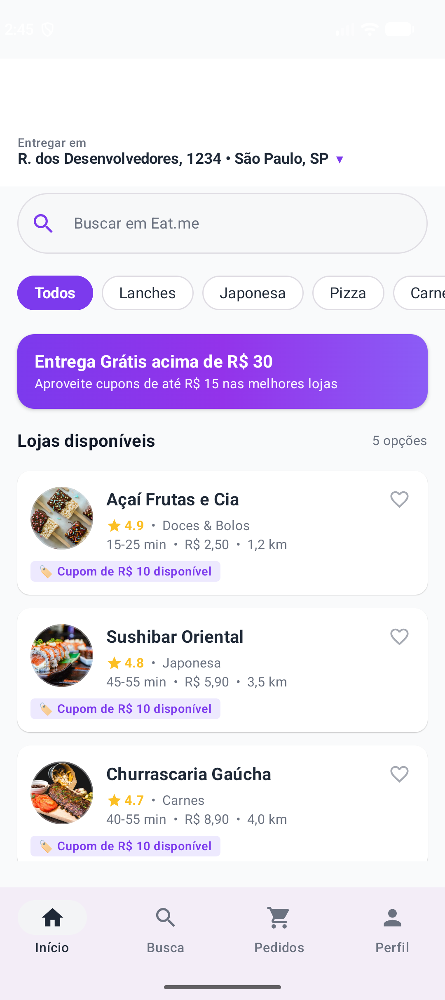
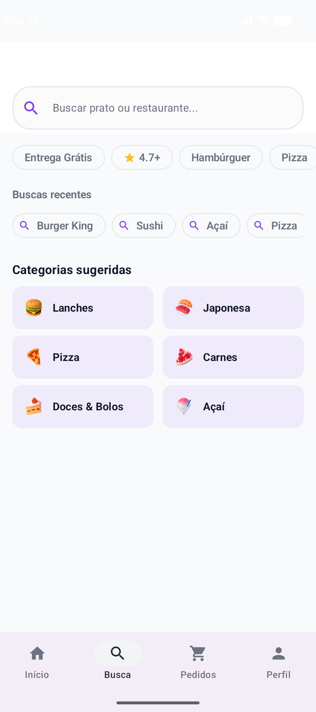
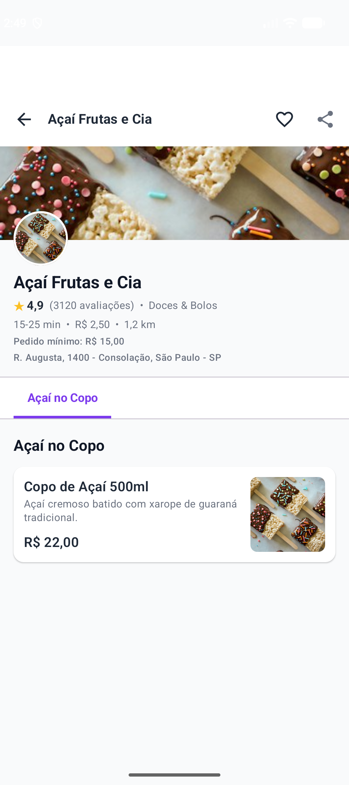
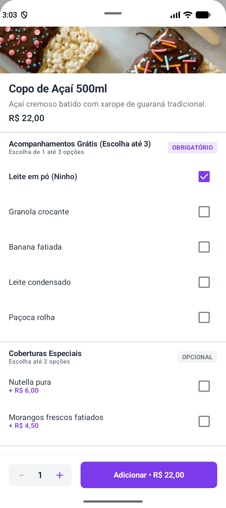
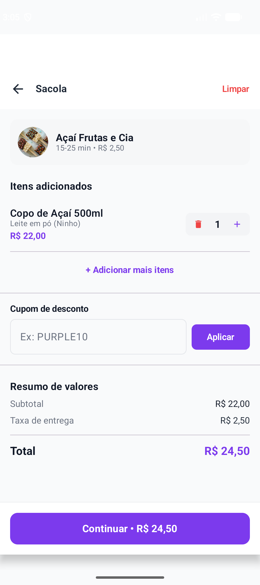
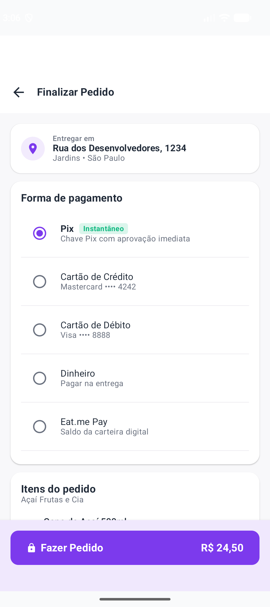
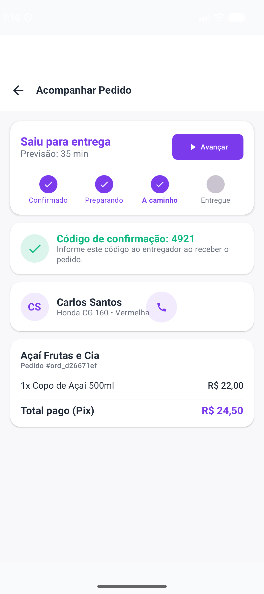
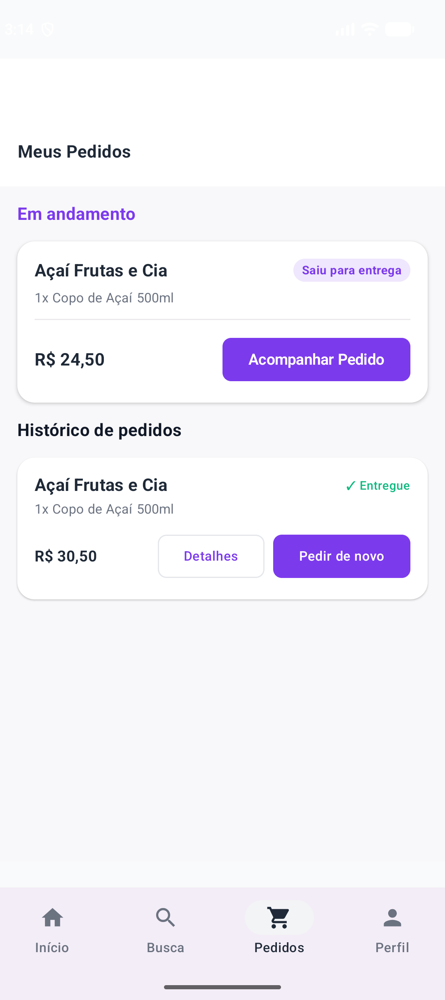
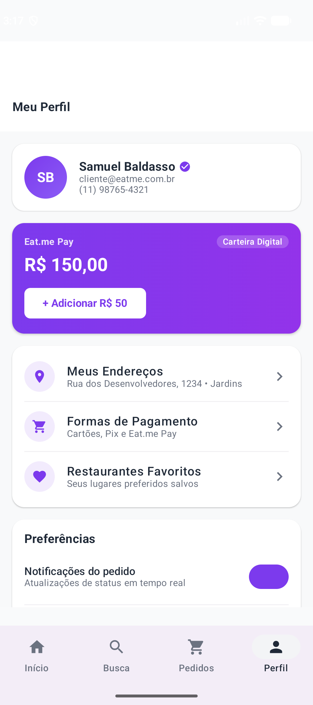

# Eat.me

Clone conceitual e produção-grade do ecossistema de delivery (estilo iFood) para Android nativo em Kotlin e Jetpack Compose, concebido com arquitetura de alta escala, modularização e princípios rigorosos de Clean Architecture e UDF/MVI, estilizado com identidade visual **Purple Theme** (`#7C3AED`).

---

## 🚀 Visão Geral e Stack Técnica

| Camada / Função | Tecnologia |
|---|---|
| **Linguagem & Concorrência** | Kotlin 2.x (K2), Coroutines, StateFlow / SharedFlow, `kotlinx.serialization` |
| **Plataforma & SDK** | Android nativo · `minSdk 26` · `targetSdk 35` · `compileSdk 35` |
| **UI & Design System** | Jetpack Compose, Material 3, Type-safe Navigation, Coil 2.x |
| **Identidade Visual** | **Purple Theme** (`#7C3AED`) com cards de alta densidade inspirados no layout original do iFood |
| **Arquitetura** | Clean Architecture + MVI (UDF), Multi-módulo por camada e feature |
| **Injeção de Dependências** | Dagger Hilt 2.51+ |
| **Persistência Local (Backend Integrado)** | Room Database com SQLite local integrado, transações reativas e Seeder automático |
| **Precisão Financeira** | Value class `Money` em centavos inteiros (`Long`), sem aproximações de ponto flutuante |
| **Testes de Qualidade** | JUnit 4/5, MockK, Turbine, Google Truth (100% dos testes unitários passando) |

---

## 📸 Demonstração Visual (Screenshots)

<div align="center">
  <table>
    <tr>
      <td align="center" width="33%">
        <br />
        <b>1. Início (Home Feed)</b>
      </td>
      <td align="center" width="33%">
        <br />
        <b>2. Busca & Categorias</b>
      </td>
      <td align="center" width="33%">
        <br />
        <b>3. Detalhes & Cardápio</b>
      </td>
    </tr>
    <tr>
      <td align="center" width="33%">
        <br />
        <b>4. Customização (BottomSheet)</b>
      </td>
      <td align="center" width="33%">
        <br />
        <b>5. Sacola & Cupons</b>
      </td>
      <td align="center" width="33%">
        <br />
        <b>6. Checkout & Pagamento</b>
      </td>
    </tr>
    <tr>
      <td align="center" width="33%">
        <br />
        <b>7. Rastreio & PIN</b>
      </td>
      <td align="center" width="33%">
        <br />
        <b>8. Histórico de Pedidos</b>
      </td>
      <td align="center" width="33%">
        <br />
        <b>9. Perfil & Carteira</b>
      </td>
    </tr>
  </table>
</div>

---

## 🏛️ Estrutura Modular

```
Eat.me
├── :core:domain-shared     # Kotlin puro JVM: Money, Entidades (Restaurant, Dish, Cart, Order), UseCases e Contratos
├── :core:designsystem      # Design tokens (Cores Roxas, Tipografia, Espaçamentos), Componentes base
├── :core:database          # Room DB, Entidades SQLite, DAOs, Relações 1:N, Seeder automático e Repositórios locais
└── :app                    # Navegação Jetpack Compose, ViewModels MVI e Telas completas da aplicação
```

---

## 📱 Fluxos e Telas Implementadas

1. **Início (Home Feed):**
   - Barra de endereço com seletor de entrega.
   - Pílula de busca estilo iFood: `"Buscar em Eat.me"`.
   - Carrossel de categorias em chips roxos.
   - Banner promocional em gradiente roxo vibrante.
   - Cards de restaurantes de alta densidade: logo circular, nome, avaliação com estrela dourada, tempo estimado, taxa de entrega, distância e etiqueta de cupom promocional.
   - Barra flutuante de sacola (`FloatingCartBar`) exibida dinamicamente quando há itens.

2. **Detalhes do Restaurante e Cardápio:**
   - Cabeçalho com banner e dados do estabelecimento.
   - Abas por seções do cardápio (Lanches, Bebidas, Sobremesas, etc.).
   - Itens com foto, preço base/promocional e descrição.
   - **BottomSheet de Customização de Prato:**
     - Seleção de opções obrigatórias (ex.: ponto da carne) e opcionais (adicionais).
     - Seletor de quantidade (1 a 20) com recálculo em tempo real do valor total em centavos.
     - Validação de regras de negócio antes de liberar o botão "Adicionar".
     - Tratamento da regra de negócio **RN-CART-01** (conflito de sacola com restaurantes diferentes com diálogo de confirmação).

3. **Sacola de Compras (Cart):**
   - Agrupamento de itens idênticos com as mesmas opções selecionadas.
   - Controles interativos de quantidade (+/-) e exclusão com feedback via Snackbar.
   - Validação e aplicação de cupons de desconto (`PURPLE10` -> R$ 10,00, `PURPLE15` -> R$ 15,00).
   - Resumo financeiro com subtotal, taxa de entrega e valor final.

4. **Checkout (Finalizar Pedido):**
   - Endereço de entrega com opção de troca rápida.
   - Seletor de método de pagamento (Pix instantâneo, Cartão de Crédito, Cartão de Débito, Dinheiro com troco, Eat.me Pay).
   - Resumo discriminado dos itens e cobranças.
   - Botão de confirmação com limpeza atômica da sacola e emissão do pedido na base Room.

5. **Acompanhamento em Tempo Real (Order Tracking):**
   - Stepper interativo de progresso: Confirmado → Em preparação → A caminho → Entregue.
   - Botão de simulação de avanço de etapas em tempo real.
   - PIN de confirmação de entrega para validação com o entregador.
   - Cartão do entregador com veículo e botão de contato.
   - Resumo completo do pedido e opção de cancelamento de pedidos ativos.

6. **Histórico de Pedidos:**
   - Lista segregada entre pedidos "Em andamento" e histórico anterior.
   - Botões de "Acompanhar Pedido", "Detalhes" e "Pedir novamente".

7. **Busca e Descoberta:**
   - Busca em tempo real por nome do restaurante e prato.
   - Filtros rápidos por "Entrega Grátis", "Avaliação 4.7+" e categorias.
   - Histórico de buscas recentes e catálogo em cards de categorias populares.

8. **Perfil do Usuário:**
   - Carteira digital **Eat.me Pay** com saldo reativo e recarga.
   - Preferências do usuário com switches para notificações e biometria.
   - Atalhos para endereços salvos, cartões e central de ajuda.

---

## 🧪 Estratégia de Testes

- **100% dos testes unitários passando em todos os módulos.**
- Domínio financeiro blindado com a value class `Money` testada contra overflow e arredondamento HALF_UP.
- Regras de negócio de sacola e pedidos validadas com Room SQLite em memória.
- ViewModels cobertos com MockK e Turbine simulando fluxos reativos e interações de usuário.

---

## 🛠️ Como Executar

```bash
# Executar a suite completa de testes unitários
./gradlew testDebugUnitTest

# Gerar APK de debug
./gradlew assembleDebug

# Instalar no dispositivo/emulador conectado
adb install -r app/build/outputs/apk/debug/app-debug.apk
```

---

## 🏛️ Architecture Decision Records (ADRs)

Para demonstrar maturidade de engenharia de software e fundamentação técnica em nível sênior, as principais decisões arquiteturais do projeto estão formalizadas:

- [**ADR-001: Representação de Valores Monetários em Centavos Inteiros (`Long`) via Kotlin Value Class**](file:///Users/sambaldasso/AndroidStudioProjects/IfoodClone/docs/adr/ADR-001-whole-cents-money-domain.md) — Eliminação de imprecisão IEEE 754 e ausência de alocação de heap via `Money`.
- [**ADR-002: Backend de Marketplace e Persistência Integrado via Room SQLite**](file:///Users/sambaldasso/AndroidStudioProjects/IfoodClone/docs/adr/ADR-002-embedded-room-database-backend.md) — Offline-first com Single Source of Truth, relações relacionais 1:N com cascata e fluxos reativos em `Flow`.
- [**ADR-003: Adoção do Padrão UDF (Unidirectional Data Flow) e MVI na Camada de Apresentação**](file:///Users/sambaldasso/AndroidStudioProjects/IfoodClone/docs/adr/ADR-003-udf-mvi-architecture.md) — Imutabilidade de estado visual (`UiState`), intenções atômicas (`Intent`) e efeitos colaterais (`UiEffect`).
- [**ADR-004: SplashScreen API Nativa (Android 12+) e Suporte a Edge-to-Edge**](file:///Users/sambaldasso/AndroidStudioProjects/IfoodClone/docs/adr/ADR-004-native-splash-and-edge-to-edge.md) — Inicialização instantânea com animação personalizada e compatibilidade total com o Android 15.
- [**ADR-005: Feedback de Carregamento por Esqueletos Shimmer no Design System**](file:///Users/sambaldasso/AndroidStudioProjects/IfoodClone/docs/adr/ADR-005-compose-shimmer-skeletons.md) — Percepção de performance aprimorada e eliminação de saltos de layout (*layout shift*).

